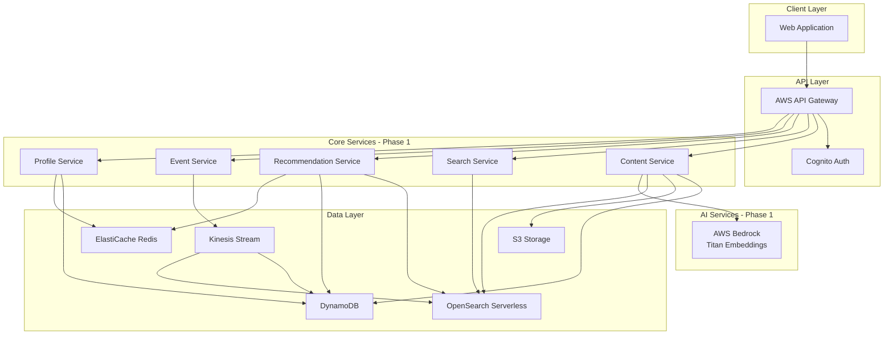
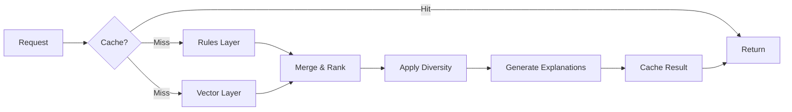

# Design Document: Inquiry Growth Engine (Asterion)

## Overview

The Inquiry Growth Engine (Asterion) is an AWS-native, AI-driven marketing and recommendation platform designed to scale Inquiry Institute's content reach and engagement. The system follows a phased implementation approach, starting with core content publishing and personalized recommendations, then expanding to AI-assisted content creation and multi-channel distribution.

### System Vision

Asterion transforms how Inquiry Institute engages with its audience by:

- Publishing high-quality content at scale (target: 50 pieces/week vs. current 10)
- Learning from user behavior to personalize recommendations (target: 15% CTR)
- Converting traffic through intelligent distribution (target: 5% conversion rate)
- Maintaining institutional quality through human review and AI assistance
- Scaling cost-effectively (target: < $0.50 per active user per month)

### Phased Capabilities

**Phase 1 (Months 1-3): Core Content & Recommendations**
- Article publishing with metadata
- Behavioral event tracking
- Two-layer recommendation engine (rules + vector similarity)
- Full-text search
- User authentication and profiles
- Web-only distribution

**Phase 2 (Months 4-6): AI Assistance & Multi-Domain**
- AI-assisted content creation (single-purpose assistant)
- Multi-domain content (courses, products, events)
- Email distribution campaigns
- Content versioning and audit trail
- Analytics dashboard

**Phase 3 (Months 7-12): Scale & Intelligence**
- Graph-based recommendations (collaborative filtering)
- Learned ranking models (Amazon Personalize)
- Multi-agent orchestration
- Faculty persona agents
- Advanced personalization

### Design Principles

- **Start Simple, Scale Smart**: Prove value with minimal features before adding complexity
- **AWS-Native Architecture**: Leverage managed services to minimize operational overhead
- **Event-Driven Design**: Loose coupling enables independent scaling and deployment
- **Cost-Conscious**: Every feature justified by ROI, with cost monitoring and optimization
- **Quality Over Quantity**: Human review gates for AI-generated content
- **Privacy by Design**: GDPR compliance built into data architecture
- **Incremental Delivery**: Each phase delivers measurable value and validates assumptions


## Architecture

### High-Level Architecture

The system follows a simplified microservices architecture built on AWS managed services. Phase 1 focuses on core services; additional services are added in later phases based on validated need.

**Phase 1 Architecture:**

**Phase 1 Architecture:**



**Phase 2 Additions:**
- Editorial Assistant Service (AI content generation)
- Email Service (SES integration)
- Analytics Service (QuickSight dashboards)

**Phase 3 Additions:**
- Agent Orchestrator (Step Functions)
- Graph Service (collaborative filtering)
- Personalize Service (learned ranking)


### AWS Service Selection

The architecture leverages AWS managed services to minimize operational overhead. Services are introduced incrementally based on phase requirements.

**Phase 1 Services:**

| Service | Purpose | Monthly Cost (Phase 1) |
|---------|---------|------------------------|
| AWS API Gateway | API management, rate limiting, auth | $300 (1M requests) |
| AWS Lambda | Serverless compute for all services | $500 (10M invocations) |
| AWS Cognito | User authentication and management | $55 (10K MAU) |
| AWS DynamoDB | Primary data store (content, users, events) | $800 (on-demand) |
| AWS OpenSearch Serverless | Search and vector similarity | $800 (10K documents) |
| AWS S3 | Content assets and event archive | $100 (1TB storage) |
| AWS CloudFront | CDN for static assets | $200 (1TB transfer) |
| AWS Kinesis Data Streams | Event streaming | $500 (1 shard) |
| ElastiCache Redis | Caching layer | $200 (cache.t3.micro) |
| AWS Bedrock | AI model access (Titan Embeddings) | $200 (embeddings) |
| AWS CloudWatch | Monitoring and logging | $300 (metrics + logs) |
| AWS X-Ray | Distributed tracing | $100 (1M traces) |
| **Total Phase 1** | | **~$4,055/month** |

**Phase 2 Additions:**

| Service | Purpose | Monthly Cost |
|---------|---------|--------------|
| AWS Bedrock | Claude 3.5 Sonnet for content generation | $1,500 (200 articles/month) |
| AWS SES | Email delivery | $10 (100K emails) |
| AWS QuickSight | Analytics dashboards | $500 (5 users) |
| **Total Phase 2** | | **~$6,065/month** |

**Phase 3 Additions:**

| Service | Purpose | Monthly Cost |
|---------|---------|--------------|
| AWS Step Functions | Agent orchestration | $500 (workflows) |
| Amazon Personalize | Learned ranking models | $2,000 (training + inference) |
| Additional Bedrock | Faculty personas, multi-agent | $3,000 (conversational AI) |
| **Total Phase 3** | | **~$11,565/month** |

**Cost Optimization Strategies:**
- Use DynamoDB on-demand pricing (pay per request)
- Lambda reserved concurrency for predictable workloads
- S3 lifecycle policies (transition to Glacier after 90 days)
- CloudFront caching to reduce origin requests
- OpenSearch right-sizing based on actual usage
- Bedrock batch processing to reduce API calls

### Domain Architecture

**Phase 1: Single Domain**

Start with a single domain for simplicity:
- `inquiry.institute` - Main website with all content

**Phase 2: Subdomain Expansion (if needed)**

Split into subdomains only if traffic patterns justify it:
- `read.inquiry.institute` - Article reading experience
- `learn.inquiry.institute` - Course catalog
- `shop.inquiry.institute` - Product marketplace
- `app.inquiry.institute` - User dashboard

**Design Decision:** Defer subdomain architecture until Phase 2. Premature splitting adds complexity without proven benefit. Monitor traffic patterns in Phase 1 to inform subdomain strategy.

### Data Storage Strategy

**Single Source of Truth Principle:**

Each entity has ONE primary data store. Other stores are derived/cached.

| Entity | Primary Store | Secondary Stores | Rationale |
|--------|---------------|------------------|-----------|
| Content | DynamoDB | OpenSearch (search), S3 (assets) | DynamoDB is source of truth, others are indexes |
| User Profile | DynamoDB | Redis (cache) | DynamoDB persists, Redis accelerates reads |
| Events | Kinesis → S3 | DynamoDB (recent), OpenSearch (analytics) | S3 is archive, others are views |
| Embeddings | OpenSearch | None | OpenSearch is both store and query engine |
| Recommendations | Redis (cache) | CloudWatch (logs) | Ephemeral, regenerated on cache miss |

**Consistency Model:**
- Strong consistency: User auth, content publication, purchases
- Eventual consistency: Search indexes, recommendations, analytics
- Cache invalidation: Write-through for profiles, TTL-based for recommendations

### Event-Driven Communication

**Phase 1: Direct Service Calls**

Start with synchronous service-to-service calls via API Gateway for simplicity:
- Content Service → Embedding Service (generate embeddings)
- Event Service → Profile Service (update user metrics)
- Recommendation Service → Content Service (fetch content details)

**Phase 2: Event Bus Introduction**

Add AWS EventBridge when async workflows become complex:
- Content published → Trigger email campaign
- User registered → Send welcome email
- Content updated → Invalidate caches

**Event Categories (Phase 2+):**
- `content.*` - Content lifecycle (published, updated, archived)
- `user.*` - User events (registered, updated_preferences)
- `behavior.*` - Behavioral signals (viewed, clicked, purchased)
- `distribution.*` - Distribution events (email_sent, email_opened)

**Design Decision:** Start synchronous, add async only when needed. EventBridge adds complexity and debugging challenges. Introduce it when workflows require decoupling or fan-out patterns.


## Components and Interfaces

### Content Service (Phase 1)

**Responsibility:** Manages article publishing, storage, and retrieval

**Implementation:**
- Lambda function behind API Gateway
- DynamoDB table for content metadata
- S3 bucket for images and assets
- OpenSearch index for full-text search
- Bedrock Titan Embeddings for vector generation

**Key Operations:**
```typescript
// Create/Update
POST /api/content
PUT /api/content/:id

// Read
GET /api/content/:id
GET /api/content?domain=article&limit=20&offset=0

// Admin only
DELETE /api/content/:id
```

**Content Data Model:**
```typescript
interface Content {
  id: string;                    // UUID
  domain: 'article';             // Phase 1: articles only
  title: string;
  description: string;
  body: string;                  // Markdown
  author: string;                // User ID
  topics: string[];              // e.g., ["philosophy", "ethics"]
  tags: string[];                // e.g., ["featured", "beginner"]
  state: 'draft' | 'published' | 'archived';
  publishedAt?: Date;
  version: number;               // Increments on update
  embedding?: number[];          // 1536-dim vector (Titan)
  createdAt: Date;
  updatedAt: Date;
}
```

**DynamoDB Table Design:**
```
Table: content
Primary Key: id (String)
GSI: domain-publishedAt-index
  - Partition: domain
  - Sort: publishedAt
  - Projection: ALL
```

**Publishing Flow:**
1. Validate content (required fields, markdown syntax)
2. Save to DynamoDB with state='draft'
3. Upload images to S3
4. Generate embedding via Bedrock (async)
5. Index in OpenSearch (async)
6. Return content ID to client

**Phase 2 Extensions:**
- Support course, product, event domains
- Content versioning (preserve history)
- Scheduled publication
- Content expiration dates

### Event Service (Phase 1)

**Responsibility:** Captures and processes user behavioral events

**Implementation:**
- Lambda function for event ingestion
- Kinesis Data Stream for event buffering
- Lambda consumer for event processing
- DynamoDB for user history
- OpenSearch for analytics

**Key Operations:**
```typescript
// Capture event
POST /api/events
Body: CanonicalEvent

// Query user history (authenticated)
GET /api/users/:id/history?limit=50
```

**Canonical Event Schema:**
```typescript
interface CanonicalEvent {
  version: '2.0';
  eventId: string;               // UUID v4
  eventType: 'view' | 'click' | 'search' | 'purchase';
  timestamp: string;             // ISO 8601 UTC
  userId?: string;               // Null for anonymous
  sessionId: string;             // UUID v4
  contentId?: string;            // Required for view/click
  metadata: {
    userAgent: string;
    deviceType: 'mobile' | 'tablet' | 'desktop';
    referrer?: string;
    ipHash?: string;             // SHA-256 for privacy
  };
}
```

**Event Processing Pipeline:**
```
1. Client → POST /api/events
2. API Gateway → Lambda (validate)
3. Lambda → Kinesis Stream (buffer)
4. Kinesis → Lambda Consumer (process)
5. Consumer → DynamoDB (user history)
6. Consumer → OpenSearch (analytics)
```

**DynamoDB Table Design:**
```
Table: user-events
Primary Key: userId (String)
Sort Key: timestamp (Number)
TTL: 7 days (hot storage)
GSI: sessionId-timestamp-index
```

**Error Handling:**
- Client-side: Buffer events in localStorage if API fails
- Server-side: Dead letter queue after 3 retries
- Monitoring: Alert if event loss rate > 1%

**Phase 2 Extensions:**
- Additional event types (share, complete, purchase)
- Real-time event processing (< 100ms)
- Event replay for debugging

### Recommendation Service (Phase 1)

**Responsibility:** Generates personalized content recommendations using two-layer strategy

**Implementation:**
- Lambda function for recommendation generation
- Redis cache for recommendation results
- DynamoDB for user preferences
- OpenSearch for vector similarity

**Key Operations:**
```typescript
// Get recommendations
GET /api/recommendations?userId=:id&count=10

// Response
interface RecommendationResponse {
  recommendations: Array<{
    contentId: string;
    score: number;               // 0-1
    source: 'rules' | 'vector';
    explanation: string;
  }>;
  generatedAt: string;
}
```

**Two-Layer Architecture:**



**Layer 1: Rules-Based (40% weight)**

```typescript
function rulesLayer(userId: string): Candidate[] {
  const profile = getUserProfile(userId);
  const candidates: Candidate[] = [];
  
  // Rule 1: User's favorite topics
  if (profile.preferences.topics.length > 0) {
    const topicContent = queryContentByTopics(
      profile.preferences.topics,
      limit: 20
    );
    candidates.push(...topicContent.map(c => ({
      contentId: c.id,
      score: 1.0,
      reason: `Matches your interest in ${c.topics[0]}`
    })));
  }
  
  // Rule 2: Trending content (high engagement last 7 days)
  const trending = queryTrendingContent(days: 7, limit: 10);
  candidates.push(...trending.map(c => ({
    contentId: c.id,
    score: 0.8,
    reason: 'Popular this week'
  })));
  
  // Rule 3: Recent content (published last 30 days)
  const recent = queryRecentContent(days: 30, limit: 10);
  candidates.push(...recent.map(c => ({
    contentId: c.id,
    score: 0.6,
    reason: 'Recently published'
  })));
  
  // Exclude already viewed
  const viewedIds = getUserViewedContent(userId);
  return candidates.filter(c => !viewedIds.includes(c.contentId));
}
```

**Layer 2: Vector Similarity (60% weight)**

```typescript
function vectorLayer(userId: string): Candidate[] {
  // Get user's recent interactions
  const recentViews = getUserViewedContent(userId, limit: 10);
  
  // Get embeddings for viewed content
  const embeddings = recentViews.map(id => getEmbedding(id));
  
  // Average embeddings to create user vector
  const userVector = averageVectors(embeddings);
  
  // Find similar content using k-NN search
  const similar = openSearchKNN({
    index: 'content',
    vector: userVector,
    k: 20,
    filter: { state: 'published' }
  });
  
  return similar.map(hit => ({
    contentId: hit.id,
    score: hit.score,  // Cosine similarity
    reason: `Similar to "${hit.similarTo}"`
  }));
}
```

**Merging and Ranking:**

```typescript
function generateRecommendations(userId: string, count: number) {
  // Check cache
  const cached = redis.get(`reco:${userId}`);
  if (cached) return cached;
  
  // Generate from both layers
  const rulesCandidates = rulesLayer(userId);
  const vectorCandidates = vectorLayer(userId);
  
  // Combine with weights
  const combined = mergeCandidates(
    rulesCandidates,
    vectorCandidates,
    weights: { rules: 0.4, vector: 0.6 }
  );
  
  // Apply diversity constraint
  const diverse = applyDiversityConstraint(
    combined,
    maxPerTopic: 0.4  // Max 40% from single topic
  );
  
  // Take top N
  const recommendations = diverse.slice(0, count);
  
  // Cache for 5 minutes
  redis.setex(`reco:${userId}`, 300, recommendations);
  
  return recommendations;
}
```

**Diversity Constraint:**
- Maximum 40% of recommendations from single topic
- Minimum 3 different topics in result set
- Penalize over-represented topics

**Performance:**
- Target latency: < 500ms (p95)
- Cache hit rate: > 80%
- Fallback: Random popular content if layers fail

**Phase 2 Extensions:**
- Graph-based layer (collaborative filtering)
- Learned ranking layer (Amazon Personalize)
- Real-time session-based personalization


### Search Service (Phase 1)

**Responsibility:** Provides full-text search across content

**Implementation:**
- Lambda function for search queries
- OpenSearch Serverless for indexing

**Key Operations:**
```typescript
// Search
GET /api/search?q=query&limit=20&offset=0

// Response
interface SearchResponse {
  results: Array<{
    contentId: string;
    title: string;
    description: string;
    snippet: string;             // Highlighted excerpt
    score: number;               // BM25 relevance
  }>;
  total: number;
  took: number;                  // Query time in ms
}
```

**OpenSearch Index Mapping:**
```json
{
  "mappings": {
    "properties": {
      "contentId": {"type": "keyword"},
      "domain": {"type": "keyword"},
      "title": {
        "type": "text",
        "analyzer": "english",
        "fields": {"keyword": {"type": "keyword"}}
      },
      "description": {"type": "text", "analyzer": "english"},
      "body": {"type": "text", "analyzer": "english"},
      "topics": {"type": "keyword"},
      "tags": {"type": "keyword"},
      "publishedAt": {"type": "date"},
      "state": {"type": "keyword"},
      "embedding": {
        "type": "knn_vector",
        "dimension": 1536,
        "method": {"name": "hnsw", "engine": "faiss"}
      }
    }
  }
}
```

**Search Query:**
```json
{
  "query": {
    "bool": {
      "must": [{
        "multi_match": {
          "query": "artificial intelligence ethics",
          "fields": ["title^3", "description^2", "body"],
          "type": "best_fields",
          "fuzziness": "AUTO"
        }
      }],
      "filter": [
        {"term": {"state": "published"}},
        {"term": {"domain": "article"}}
      ]
    }
  },
  "highlight": {
    "fields": {
      "title": {},
      "description": {},
      "body": {"fragment_size": 150, "number_of_fragments": 1}
    }
  },
  "size": 20,
  "from": 0
}
```

**Features:**
- Full-text search with BM25 ranking
- Fuzzy matching (edit distance ≤ 2)
- Result highlighting
- Field boosting (title > description > body)

**Performance:**
- Target latency: < 500ms (p95)
- Index update latency: < 5 seconds

**Phase 2 Extensions:**
- Faceted search (filter by topic, date)
- Autocomplete suggestions
- Semantic search using embeddings


### Profile Service (Phase 1)

**Responsibility:** Manages user profiles and preferences

**Implementation:**
- Lambda function for profile operations
- DynamoDB for profile storage
- Redis for profile caching

**Key Operations:**
```typescript
// Get profile (authenticated)
GET /api/users/:id/profile

// Update preferences (authenticated)
PUT /api/users/:id/profile
Body: { preferences: {...} }

// Get user history (authenticated)
GET /api/users/:id/history?limit=50
```

**User Profile Schema:**
```typescript
interface UserProfile {
  userId: string;                // Cognito user ID
  email: string;
  name: string;
  preferences: {
    topics: string[];            // e.g., ["philosophy", "science"]
    contentTypes: string[];      // e.g., ["article"]
    emailFrequency: 'daily' | 'weekly' | 'never';
  };
  behavior: {
    lastActive: Date;
    totalViews: number;
    totalPurchases: number;
  };
  privacy: {
    trackingConsent: boolean;
    emailConsent: boolean;
  };
  createdAt: Date;
  updatedAt: Date;
}
```

**DynamoDB Table Design:**
```
Table: user-profiles
Primary Key: userId (String)
Attributes: email, name, preferences, behavior, privacy, timestamps
```

**Caching Strategy:**
- Cache active profiles in Redis (10-minute TTL)
- Write-through cache on updates
- Cache key: `profile:{userId}`

**Performance:**
- Profile load: < 200ms (p95)
- Cache hit rate: > 90%

---

### Editorial Assistant Service (Phase 2)

**Responsibility:** AI-assisted content creation

**Implementation:**
- Lambda function for content generation
- Bedrock Claude 3.5 Sonnet for text generation
- OpenSearch for RAG (retrieve similar articles)

**Key Operations:**
```typescript
// Generate article draft (authenticated, admin only)
POST /api/editorial/generate
Body: {
  topic: string;
  outline?: string;
  targetLength?: number;
}

// Response
interface DraftResponse {
  draft: string;                 // Markdown
  citations: Array<{
    contentId: string;
    title: string;
    excerpt: string;
  }>;
  metadata: {
    model: 'claude-3.5-sonnet';
    tokensUsed: number;
    generationTime: number;
  };
}
```

**RAG Implementation:**
```typescript
async function generateDraft(topic: string, outline?: string) {
  // 1. Generate query embedding
  const queryEmbedding = await bedrock.generateEmbedding(topic);
  
  // 2. Search for similar institutional content
  const similar = await openSearch.knnSearch({
    index: 'content',
    vector: queryEmbedding,
    k: 5,
    filter: { state: 'published' }
  });
  
  // 3. Construct prompt with context
  const prompt = `
You are an expert writer for Inquiry Institute. Generate an article draft on the following topic.

Topic: ${topic}
${outline ? `Outline: ${outline}` : ''}

Reference these institutional articles for context:
${similar.map(s => `- ${s.title}: ${s.excerpt}`).join('\n')}

Requirements:
- 800-1200 words
- Maintain institutional voice (thoughtful, accessible, rigorous)
- Include inline citations to reference articles
- Use markdown formatting
`;

  // 4. Generate with Claude
  const response = await bedrock.invoke({
    modelId: 'anthropic.claude-3-5-sonnet-20241022-v2:0',
    body: {
      anthropic_version: 'bedrock-2023-05-31',
      max_tokens: 2000,
      messages: [{
        role: 'user',
        content: prompt
      }]
    }
  });
  
  // 5. Extract draft and citations
  const draft = response.content[0].text;
  const citations = similar.map(s => ({
    contentId: s.id,
    title: s.title,
    excerpt: s.excerpt
  }));
  
  return { draft, citations };
}
```

**Quality Controls:**
- All AI-generated content flagged with `aiAssisted: true`
- Human review required before publication
- Plagiarism check (> 80% similarity to source = reject)
- Readability score (Flesch-Kincaid 10-12)

**Cost Management:**
- Batch requests when possible
- Cache common queries
- Monitor token usage
- Alert if cost > $50/day

**Phase 3 Extensions:**
- Multi-agent workflow (Editorial + Governance)
- Automated fact-checking
- SEO optimization

---

### Email Service (Phase 2)

**Responsibility:** Email campaign management and delivery

**Implementation:**
- Lambda function for campaign management
- AWS SES for email delivery
- DynamoDB for campaign tracking

**Key Operations:**
```typescript
// Create campaign (authenticated, admin only)
POST /api/campaigns
Body: EmailCampaign

// Send campaign
POST /api/campaigns/:id/send

// Get campaign metrics
GET /api/campaigns/:id/metrics
```

**Email Campaign Schema:**
```typescript
interface EmailCampaign {
  id: string;
  name: string;
  subject: string;
  template: string;              // Handlebars template
  audience: {
    segment: 'all' | 'active' | 'inactive';
    topicFilter?: string[];
  };
  schedule: {
    type: 'immediate' | 'scheduled';
    sendAt?: Date;
  };
  status: 'draft' | 'sending' | 'sent';
  metrics: {
    sent: number;
    delivered: number;
    opened: number;
    clicked: number;
    bounced: number;
    unsubscribed: number;
  };
}
```

**Email Template Example:**
```handlebars
Subject: Your weekly reading from Inquiry Institute

Hi {{user.name}},

Based on your interests in {{#each user.topics}}{{this}}{{#unless @last}}, {{/unless}}{{/each}}, here are this week's top articles:

{{#each recommendations}}
<h3>{{this.title}}</h3>
<p>{{this.description}}</p>
<a href="{{this.url}}">Read more</a> ({{this.readTime}} min)
{{/each}}

<a href="{{preferencesUrl}}">Update preferences</a> | <a href="{{unsubscribeUrl}}">Unsubscribe</a>
```

**Sending Flow:**
1. Query users matching audience criteria
2. Filter out unsubscribed users
3. Generate personalized recommendations for each user
4. Render email template with user data
5. Send via SES (rate-limited to 14/sec)
6. Track delivery events (delivered, opened, clicked)

**Tracking:**
- Delivery: SES SNS notifications
- Opens: 1x1 tracking pixel
- Clicks: Redirect through tracking URL
- Unsubscribes: Update profile immediately

**Performance:**
- Campaign send time: < 1 hour for 50K users
- Delivery rate: > 95%
- Open rate target: > 20%

---


## Data Models

### DynamoDB Tables

**Table: content**
```
Primary Key: id (String) - UUID
Attributes:
  - domain (String) - 'article' | 'course' | 'product' | 'event'
  - title (String)
  - description (String)
  - body (String) - Markdown
  - author (String) - User ID
  - topics (StringSet)
  - tags (StringSet)
  - state (String) - 'draft' | 'published' | 'archived'
  - publishedAt (Number) - Unix timestamp
  - version (Number)
  - createdAt (Number)
  - updatedAt (Number)

GSI: domain-publishedAt-index
  - Partition: domain
  - Sort: publishedAt
  - Projection: ALL
  
Capacity: On-demand
Encryption: AWS managed
TTL: None (content retained indefinitely)
```

**Table: user-profiles**
```
Primary Key: userId (String) - Cognito user ID
Attributes:
  - email (String)
  - name (String)
  - preferences (Map)
    - topics (StringSet)
    - contentTypes (StringSet)
    - emailFrequency (String)
  - behavior (Map)
    - lastActive (Number)
    - totalViews (Number)
    - totalPurchases (Number)
  - privacy (Map)
    - trackingConsent (Boolean)
    - emailConsent (Boolean)
  - createdAt (Number)
  - updatedAt (Number)

Capacity: On-demand
Encryption: AWS managed
```

**Table: user-events**
```
Primary Key: userId (String)
Sort Key: timestamp (Number) - Unix timestamp
Attributes:
  - eventId (String) - UUID
  - eventType (String)
  - sessionId (String)
  - contentId (String)
  - metadata (Map)

GSI: sessionId-timestamp-index
  - Partition: sessionId
  - Sort: timestamp
  - Projection: ALL

Capacity: On-demand
TTL: timestamp + 7 days (hot storage only)
```

**Table: email-campaigns** (Phase 2)
```
Primary Key: id (String) - UUID
Attributes:
  - name (String)
  - subject (String)
  - template (String)
  - audience (Map)
  - schedule (Map)
  - status (String)
  - metrics (Map)
  - createdAt (Number)
  - updatedAt (Number)

Capacity: On-demand
```

### S3 Buckets

**Bucket: content-assets**
```
Purpose: Store images, videos, attachments
Structure:
  /{contentId}/
    - hero.jpg
    - diagram1.png
    - video.mp4

Lifecycle:
  - Standard storage (frequent access)
  - No transition (assets needed indefinitely)

Security:
  - Private bucket
  - CloudFront OAI for public access
  - Versioning enabled
```

**Bucket: event-archive**
```
Purpose: Long-term event storage
Structure:
  /year=2026/month=03/day=06/
    - events-{timestamp}.json.gz

Lifecycle:
  - Standard: 0-90 days
  - Glacier: 90+ days
  - Retention: 7 years

Security:
  - Private bucket
  - Server-side encryption (SSE-S3)
```

### OpenSearch Indexes

**Index: content**
```
Purpose: Full-text search and vector similarity
Shards: 2 (auto-managed by Serverless)
Replicas: 2 (auto-managed)

Documents: ~10,000 (Phase 1)
Size: ~500 MB

Mappings: See Search Service section
```

**Index: events** (Phase 2)
```
Purpose: Analytics and user behavior analysis
Retention: 7 days (hot analytics)

Documents: ~100K/day
Size: ~10 GB

Mappings:
  - eventId (keyword)
  - eventType (keyword)
  - userId (keyword)
  - contentId (keyword)
  - timestamp (date)
  - metadata (object)
```

### Redis Cache

**Instance: cache.t3.micro** (Phase 1)
```
Memory: 0.5 GB
Purpose: Cache recommendations and profiles

Keys:
  - reco:{userId} - Recommendation results (TTL: 5 min)
  - profile:{userId} - User profiles (TTL: 10 min)
  - trending:articles - Trending content (TTL: 1 hour)

Eviction: allkeys-lru
Persistence: None (cache only)
```

### Data Relationships

```mermaid
erDiagram
    USER ||--o{ CONTENT : creates
    USER ||--o{ EVENT : generates
    USER ||--o{ CAMPAIGN : receives
    CONTENT ||--o{ EMBEDDING : has
    
    USER {
        string userId PK
        string email
        string name
        map preferences
        map behavior
        map privacy
    }
    
    CONTENT {
        string id PK
        string domain
        string title
        string description
        string body
        string author FK
        stringset topics
        string state
        number publishedAt
    }
    
    EVENT {
        string userId PK
        number timestamp SK
        string eventId
        string eventType
        string contentId FK
        map metadata
    }
    
    EMBEDDING {
        string contentId PK
        array vector
        string index
    }
    
    CAMPAIGN {
        string id PK
        string name
        string subject
        map audience
        map metrics
    }
```

### Data Access Patterns

**Pattern 1: Get User Profile**
```
1. Check Redis: GET profile:{userId}
2. If miss, query DynamoDB: GetItem(user-profiles, userId)
3. Cache in Redis: SETEX profile:{userId} 600 {profile}
4. Return profile

Latency: 5ms (cache hit), 50ms (cache miss)
```

**Pattern 2: List Published Articles**
```
1. Query DynamoDB GSI: domain-publishedAt-index
   - Partition: domain='article'
   - Sort: publishedAt DESC
   - Limit: 20
2. Return results

Latency: 20ms (p95)
```

**Pattern 3: Search Content**
```
1. Query OpenSearch: content index
   - Full-text match on title/description/body
   - Filter: state='published'
   - Highlight: true
2. Return results with snippets

Latency: 200ms (p95)
```

**Pattern 4: Get Recommendations**
```
1. Check Redis: GET reco:{userId}
2. If miss:
   a. Get user profile (Pattern 1)
   b. Run rules layer (DynamoDB queries)
   c. Run vector layer (OpenSearch k-NN)
   d. Merge and rank results
   e. Cache: SETEX reco:{userId} 300 {recommendations}
3. Return recommendations

Latency: 50ms (cache hit), 500ms (cache miss)
```

**Pattern 5: Record Event**
```
1. Validate event schema
2. Publish to Kinesis stream
3. Consumer writes to:
   - DynamoDB: user-events table
   - OpenSearch: events index (Phase 2)
4. Update user behavior metrics

Latency: 200ms (async processing)
```

**Pattern 6: Generate Content Embedding**
```
1. Extract text: title + description + body (first 500 words)
2. Call Bedrock Titan Embeddings API
3. Store vector in OpenSearch content index
4. Update content record with embedding flag

Latency: 5-10 seconds (async)
```

### Data Consistency

**Strong Consistency:**
- User authentication (Cognito)
- Content publication state (DynamoDB)
- User profile updates (DynamoDB)

**Eventual Consistency:**
- Search index updates (< 5 seconds)
- Recommendation cache (5-minute TTL)
- Analytics dashboards (5-minute refresh)
- Event processing (< 1 second)

**Conflict Resolution:**
- User preferences: Last-write-wins
- Behavioral metrics: Additive (sum)
- Content versions: Increment counter

### Data Retention

| Data Type | Hot Storage | Warm Storage | Cold Storage | Total Retention |
|-----------|-------------|--------------|--------------|-----------------|
| User profiles | DynamoDB | - | - | Account lifetime |
| Content | DynamoDB + S3 | - | - | Indefinite |
| Events (recent) | DynamoDB | - | - | 7 days |
| Events (archive) | - | S3 Standard | S3 Glacier | 7 years |
| Recommendations | Redis (5 min) | - | - | Ephemeral |
| Logs | CloudWatch (90d) | S3 (1y) | S3 Glacier (7y) | 7 years |
| Embeddings | OpenSearch | - | - | Indefinite |

### GDPR Compliance

**Data Export:**
```
1. User requests data export
2. Query all tables for userId
3. Generate JSON with:
   - Profile
   - Preferences
   - Event history
   - Email history
4. Upload to S3 with signed URL
5. Email user download link (expires 48h)

Timeline: < 48 hours
```

**Data Deletion:**
```
Immediate (< 48 hours):
1. Mark profile as deleted in DynamoDB
2. Stop all email communications
3. Remove from recommendation cache
4. Anonymize userId in future events

Delayed (90 days):
1. Purge profile from DynamoDB
2. Delete events from S3 archive
3. Remove from OpenSearch indexes
4. Retain aggregated analytics (no PII)

Timeline: Logical deletion < 48h, physical purge < 90 days
```

**Challenge: Graph Deletion**
- Problem: Deleting user breaks collaborative filtering
- Solution: Replace user node with anonymous placeholder
- Preserve: Edge weights for recommendation quality
- Remove: All PII (name, email, preferences)ache first
**Challenge: Graph Deletion**
- Problem: Deleting user breaks collaborative filtering
- Solution: Replace user node with anonymous placeholder
- Preserve: Edge weights for recommendation quality
- Remove: All PII (name, email, preferences)

---

## Deployment Architecture

### Infrastructure as Code

**Tool:** AWS CDK (TypeScript)

**Stack Organization:**
```
cdk/
├── lib/
│   ├── network-stack.ts          # VPC, subnets, security groups
│   ├── data-stack.ts              # DynamoDB, S3, OpenSearch
│   ├── compute-stack.ts           # Lambda functions
│   ├── api-stack.ts               # API Gateway, Cognito
│   ├── monitoring-stack.ts        # CloudWatch, X-Ray
│   └── pipeline-stack.ts          # CI/CD pipeline
├── bin/
│   └── app.ts                     # CDK app entry point
└── package.json
```

**Environments:**
- `dev` - Development environment (minimal resources)
- `staging` - Pre-production (production-like)
- `prod` - Production (full scale)

### CI/CD Pipeline

**Tool:** AWS CodePipeline + CodeBuild

**Pipeline Stages:**
```
1. Source: GitHub webhook triggers on main branch
2. Build:
   - Install dependencies (npm install)
   - Run linter (eslint)
   - Run unit tests (jest)
   - Build Lambda packages
3. Test (Staging):
   - Deploy to staging environment
   - Run integration tests
   - Run load tests (k6)
4. Approval:
   - Manual approval gate
5. Deploy (Production):
   - Deploy to production
   - Run smoke tests
   - Monitor error rates
6. Rollback:
   - Automatic rollback if error rate > 5%
```

### Lambda Deployment

**Packaging:**
- Each service is a separate Lambda function
- Dependencies bundled with esbuild
- Layer for shared code (SDK, utilities)

**Configuration:**
```typescript
const contentService = new lambda.Function(this, 'ContentService', {
  runtime: lambda.Runtime.NODEJS_20_X,
  handler: 'index.handler',
  code: lambda.Code.fromAsset('dist/content-service'),
  memorySize: 512,
  timeout: Duration.seconds(30),
  environment: {
    CONTENT_TABLE: contentTable.tableName,
    OPENSEARCH_ENDPOINT: opensearch.domainEndpoint,
    BEDROCK_REGION: 'us-east-1'
  },
  tracing: lambda.Tracing.ACTIVE,  // X-Ray
  reservedConcurrentExecutions: 100  // Limit concurrency
});
```

**Versioning:**
- Publish new version on each deployment
- Alias `live` points to current version
- Alias `canary` for gradual rollout (10% traffic)

### Database Migrations

**DynamoDB:**
- Schema-less, no migrations needed
- Add GSIs via CDK (online operation)
- Backfill data with Lambda batch job

**OpenSearch:**
- Index mappings versioned (content-v1, content-v2)
- Reindex with zero downtime:
  1. Create new index with updated mapping
  2. Reindex data from old to new
  3. Update alias to point to new index
  4. Delete old index after validation

### Monitoring and Alerting

**CloudWatch Dashboards:**

**Dashboard: System Health**
- API Gateway: Request count, latency (p50/p95/p99), error rate
- Lambda: Invocation count, duration, errors, throttles
- DynamoDB: Read/write capacity, throttles
- OpenSearch: Query latency, indexing rate
- Kinesis: Incoming records, iterator age

**Dashboard: Business Metrics**
- Active users (DAU, MAU)
- Content views
- Recommendation CTR
- Search queries
- Email metrics (sent, opened, clicked)

**CloudWatch Alarms:**

| Alarm | Threshold | Action |
|-------|-----------|--------|
| API error rate | > 1% for 5 min | Page on-call |
| API latency p95 | > 1s for 5 min | Warning alert |
| Lambda errors | > 10/min | Warning alert |
| DynamoDB throttles | > 0 for 5 min | Warning alert |
| Kinesis iterator age | > 1 minute | Warning alert |
| OpenSearch CPU | > 80% for 10 min | Warning alert |
| Cost anomaly | > 20% daily increase | Email finance team |

**X-Ray Tracing:**
- Trace all API requests end-to-end
- Identify slow components
- Debug errors with full context
- Sample rate: 10% (reduce cost)

**Structured Logging:**
```typescript
// Use consistent log format
logger.info('Content published', {
  contentId: content.id,
  author: content.author,
  domain: content.domain,
  timestamp: Date.now()
});

// Searchable in CloudWatch Insights
```

### Security

**Authentication:**
- AWS Cognito for user management
- JWT tokens (24-hour expiration)
- Refresh tokens (30-day expiration)
- MFA optional (Phase 2)

**Authorization:**
- API Gateway authorizer validates JWT
- Lambda checks user permissions
- Admin endpoints require `admin` role

**Network Security:**
- API Gateway: Public (HTTPS only)
- Lambda: VPC for database access
- DynamoDB: VPC endpoints (no internet)
- OpenSearch: VPC-only access
- S3: Private buckets, CloudFront OAI

**Data Security:**
- Encryption at rest: AWS managed keys (KMS)
- Encryption in transit: TLS 1.3
- Secrets: AWS Secrets Manager
- PII: Hashed (IP addresses), encrypted (email)

**API Security:**
- Rate limiting: API Gateway throttling
- Input validation: JSON Schema validation
- SQL injection: N/A (NoSQL only)
- XSS: Sanitize user inputs
- CORS: Whitelist allowed origins

**Compliance:**
- GDPR: Data export/deletion workflows
- SOC 2: Audit logging, access controls
- HIPAA: N/A (no health data)

### Cost Optimization

**Strategies:**
- DynamoDB: On-demand pricing (pay per request)
- Lambda: Right-size memory (512 MB sufficient)
- S3: Lifecycle policies (Glacier after 90 days)
- CloudFront: Caching (reduce origin requests)
- OpenSearch: Right-size cluster (monitor usage)
- Bedrock: Batch requests, cache results

**Cost Monitoring:**
- AWS Cost Explorer: Daily cost breakdown
- Budget alerts: Email if > 20% over budget
- Cost allocation tags: Track cost by service
- Monthly review: Identify optimization opportunities

**Estimated Monthly Costs:**
- Phase 1: $4,055/month (10K users)
- Phase 2: $6,065/month (50K users)
- Phase 3: $11,565/month (100K users)

### Disaster Recovery

**Backup Strategy:**
- DynamoDB: Point-in-time recovery (35 days)
- S3: Versioning enabled, cross-region replication
- OpenSearch: Automated snapshots (daily, 14 days)

**Recovery Objectives:**
- RPO (Recovery Point Objective): 4 hours
- RTO (Recovery Time Objective): 8 hours

**DR Runbook:**
1. Detect outage (CloudWatch alarms)
2. Assess impact (which services affected)
3. Restore from backups:
   - DynamoDB: Restore to point in time
   - S3: Restore from versioned objects
   - OpenSearch: Restore from snapshot
4. Validate data integrity
5. Resume traffic
6. Post-mortem analysis

**Testing:**
- Quarterly DR drills
- Monthly backup restoration tests
- Document lessons learned

---

## Phase Implementation Plan

### Phase 1: Core Content & Recommendations (Months 1-3)

**Week 1-2: Infrastructure Setup**
- Set up AWS accounts and IAM roles
- Configure CDK project structure
- Deploy network stack (VPC, subnets)
- Set up CI/CD pipeline

**Week 3-4: Data Layer**
- Deploy DynamoDB tables
- Deploy S3 buckets
- Deploy OpenSearch cluster
- Deploy Redis cache

**Week 5-6: Core Services**
- Implement Content Service
- Implement Event Service
- Implement Profile Service
- Deploy API Gateway + Cognito

**Week 7-8: Search & Recommendations**
- Implement Search Service
- Implement Recommendation Service (rules layer)
- Integrate Bedrock for embeddings
- Implement vector similarity layer

**Week 9-10: Frontend Integration**
- Build web application (React)
- Integrate authentication
- Implement content browsing
- Implement search and recommendations

**Week 11-12: Testing & Launch**
- Load testing (k6)
- Security audit
- Performance optimization
- Soft launch to 100 beta users

**Success Criteria:**
- 10,000 active users
- 15% recommendation CTR
- 20 articles/week published
- < 500ms API latency (p95)
- 99.9% uptime

### Phase 2: AI Assistance & Multi-Domain (Months 4-6)

**Week 13-14: Editorial Assistant**
- Implement Editorial Assistant Service
- Integrate Claude 3.5 Sonnet
- Build RAG pipeline
- Create admin UI for content generation

**Week 15-16: Email Distribution**
- Implement Email Service
- Integrate AWS SES
- Build email templates
- Implement campaign management UI

**Week 17-18: Multi-Domain Content**
- Extend Content Service for courses/products/events
- Update search and recommendations
- Build domain-specific UIs

**Week 19-20: Analytics & Versioning**
- Deploy QuickSight dashboards
- Implement content versioning
- Build analytics UI
- Implement A/B testing framework

**Week 21-24: Optimization & Scale**
- Performance optimization
- Cost optimization
- Security hardening
- Scale to 50K users

**Success Criteria:**
- 50,000 active users
- 5% conversion rate
- 50 pieces/week published
- 70% AI drafts publishable with minor edits
- < $0.50 per active user per month

### Phase 3: Scale & Intelligence (Months 7-12)

**Month 7-8: Graph Recommendations**
- Build user-content-topic graph
- Implement graph-based layer
- Integrate with recommendation engine

**Month 9-10: Learned Ranking**
- Integrate Amazon Personalize
- Train ranking models
- A/B test learned vs. rules-based

**Month 11-12: Multi-Agent & Personas**
- Implement agent orchestration (Step Functions)
- Build Faculty Persona agents
- Deploy advanced personalization

**Success Criteria:**
- 100,000+ active users
- System scales to target load
- Advanced AI features validated
- Positive ROI on AI investments

---

## Conclusion

This design document outlines a pragmatic, phased approach to building the Inquiry Growth Engine. The architecture prioritizes:

1. **Simplicity First**: Start with proven patterns, add complexity only when needed
2. **Cost Consciousness**: Every feature justified by ROI, with cost monitoring built in
3. **Incremental Value**: Each phase delivers measurable business value
4. **Operational Excellence**: Monitoring, alerting, and disaster recovery from day one
5. **Scalability**: AWS managed services enable horizontal scaling without operational burden

The phased implementation allows for course correction based on real user data, reducing risk and ensuring resources are invested in features that deliver value.

